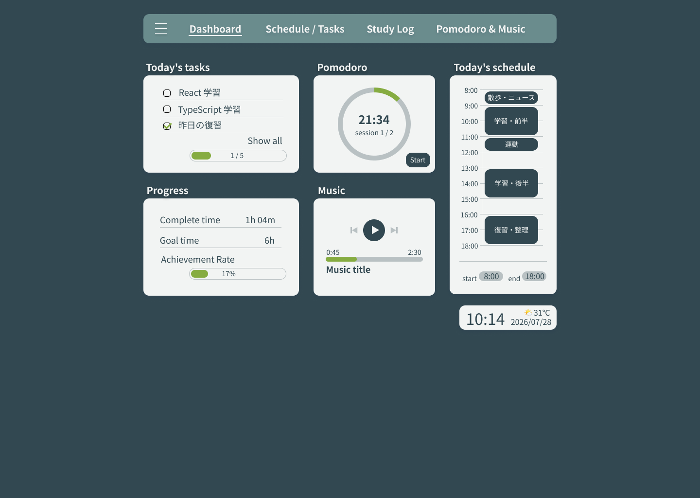
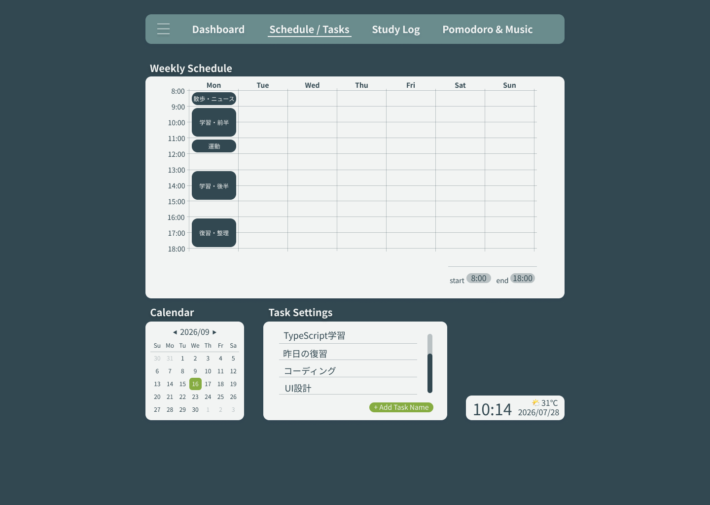
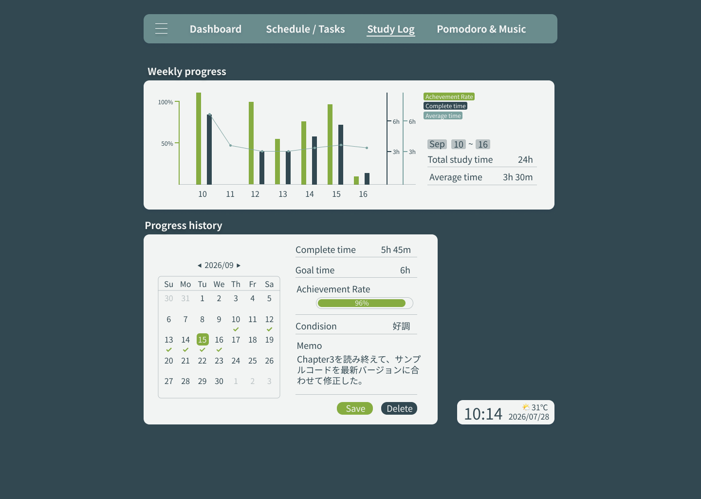
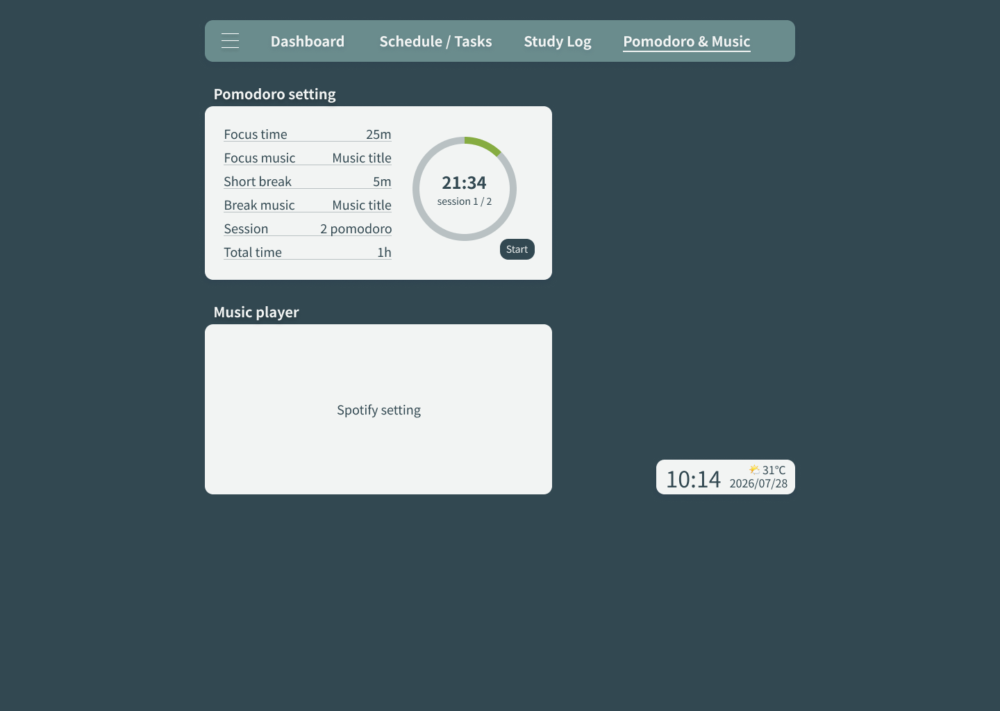

# study-dashboard

A personal study dashboard built with React and TypeScript.

## UIのデザイン

[FigmaDesign]https://www.figma.com/design/anYbtU0j5asOa2qFqMiU27/study-dashboard?node-id=0-1&t=GtreudVzBmkXde3w-1

### Dashboard

### Schedule/Tasks

### Study Log

### Pomodoro & Music

